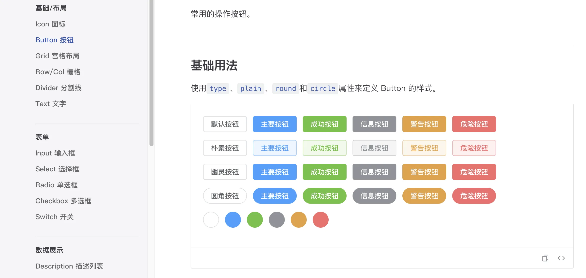
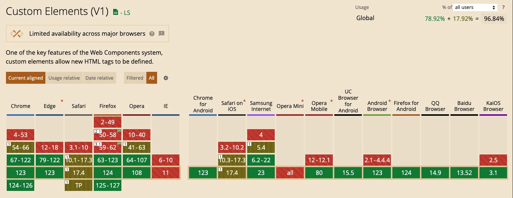

# Web Component 组件库有什么优势

## 前言

前端目前比较主流的框架有 react，vuejs，angular 等。 我们通常去搭建组件库的时候都是基于某一种框架去搭建，比如 `ant-design` 是基于 `react` 搭建的UI组件库，而 `element-plus` 则是基于 `vuejs` 搭建的组件库。

可能你有这种体会，在开发 vue 项目需要用到一个库插件，去搜索一遍发现只有 react 开发的功能比较符合自己的需求，这时候就比较纠结了。虽然目前社区有相关工具 像 [veaury](https://github.com/devilwjp/veaury)，提供框架之间的转化服务，比如 vuejs 组件转化为 react 组件。但是毕竟是不同的框架，有不同的标准。如果有问题，就不知道从何入手调试解决问题了。

并且框架升级之后，比如从 2.x 升级到 3.x，总是带来一定的破坏性，升级和更改框架的成本很大，项目业务稳定后几乎是不可能升级。

所以在寻找有没有哪一种 UI 库可以跨越框架限制使用在项目中，在了解 web-component 技术后，使用 [Stencil.js](https://stenciljs.com/) 框架根据 `Element-plus` 设计造轮子搭建了一个 [stencil-component-ui](https://webjeffery.github.io/stencil-component-ui/components/button.html) 示例组件库，发现这是一种不错的技术和方向。




没错，上面看到的是 web-component 开发的 button 组件，感觉和 element-plus button 按钮长的一样，不过开发起来更简单代码量更少，而且能用在 *React/Vue/Angular* 不同框架项目上，甚至能用在 *纯JS和服务端渲染* 静态网站

注意：只是简单示例项目，功能不完善

## 什么是web-component

"Web Components" 是一组现代的 Web 开发标准和技术，它的一系列 HTML 和 DOM 的特性加入 w3c 标准，允许开发者创建封装好的、可复用的自定义元素。这些自定义元素可以在 HTML 中用作一等公民，与原生的 HTML 元素一样的使用

由于 Web Components 是由w3c组织去推动的，因此它很有可能在不久的将来成为浏览器的一个标配。

在我了解到京东 [micro-app](https://micro-zoe.github.io/micro-app/) 微前端框架、[taro-ui](https://taro-ui.taro.zone/#/) UI 库，语雀的富文本编辑器都使用到 web components 技术

## web-component 特性

Web Components 由 3 个核心部分组成

### Custom Elements

这项技术允许开发者定义自己的 HTML 元素。可以创建新的 HTML 标签，并定义它们的行为。一旦一个 Custom Element 被定义和注册，可以在页面上像使用其他 HTML 元素一样使用它。

```html
<my-element></my-element>
```
### Shadow DOM
Shadow DOM 允许开发者封装一个 DOM 子树和样式，让它们与主文档的 DOM 保持独立。这意味着在组件内部定义的样式不会影响到外部的页面，反之亦然。

例如，在 Shadow DOM 中的样式只影响 Shadow DOM：
```html
<my-element>
  #shadow-root
    <style>
      p { color: red; }
    </style>
    <p>This is in shadow DOM and styled red.</p>
</my-element>
```
### HTML Templates

HTML Templates 通过 `<template>` 和 `<slot>` 元素，允许定义一个可以在 JavaScript 中使用的 HTML 片段。它在不被引用的情况下不会被渲染，且不会影响页面的加载。
例如：
```html
<template id="my-template">
  <p>My Template</p>
</template>
```

## 应用场景

Web Components 提供了一种创建可重用、封装和模块化的自定义 HTML 元素的方式。由于它们是基于 Web 平台的标准技术构建的，这意味着构建的 Web Components 可以在任何使用了现代 Web 技术的应用中使用，无论这些应用是使用哪种框架（如 React、Angular、Vue 等）或者不使用框架构建的。

在 [caniuse](https://caniuse.com/) 查看它的兼容性，不兼容 IE11，Vue3 都不兼容 IE11了，总体还不错



使用 Web Component 可以做的事情

1、*开发 UI 组件库*：
- 开发一个通用的、可在多个项目中重用的 UI 组件库。
- 由于 Web Components 本质上是框架无关的，它们可以在不同的前端框架中使用，增强其可移植性。

2、*第三方组件*：
- 创建可以轻松集成到其他应用的第三方组件（例如，社交分享按钮、聊天窗口、支付窗口等）。
- 避免样式和脚本干扰，提供更加干净、无冲突的集成。

3、*微前端*：
- 使用 Web Components 构建微前端，允许将大型应用拆分成独立部署的较小应用，这些较小的应用可以由不同的团队独立开发和部署。
- 由于 Web Components 的封装性，不同的微前端应用不会互相干扰。

4、*嵌入内容和小部件*：
- 创建可嵌入到其他应用中的内容和小部件，例如：评论系统、天气小部件等。

5、*多平台应用*：
- 构建能在多个平台（桌面、移动、Web）上运行的应用。使用 Web Components 可以保证在不同平台之间重用 UI 组件。

所以 Web Components 天然的和我们开发的组件思想相吻合，支持原子性、可复用、可重组，并且移植性强，支持跨平台跨框架

## 入门示例

接下来介绍 如何创建一个简单 Web Components 组件

*1、定义组件*

```js
/**
 * 使用 customElements.define() 方法用来注册一个 custom element
 * 参数如下：
 * - 元素名称，符合 DOMString 规范，名称不能是单个单词，且必须用短横线隔开
 * - 元素行为，必须是一个类
 * - 继承元素，可选配置，一个包含 extends 属性的配置对象，指定创建的元素继承自哪个内置元素，可以继承任何内置元素。
 */

class MyCustomElement extends HTMLElement {
    constructor(){
        super();
        this.render();
    }
    render(){
        const shadow = this.attachShadow({mode: 'open'});
        const text = document.createElement("span");
        text.textContent = 'Hi Custom Element!';
        text.style = 'color: red';
        shadow.append(text);
    }
}

customElements.define('my-custom-element', MyCustomElement)
```

*2、使用组件*

```html
<!DOCTYPE html>
<html lang="en">
<head>
    <script src="./index.js" defer></script>
</head>
<body>
    <h1>my-custom-element</h1>
    <my-custom-element></my-custom-element>
</body>
</html>
```

上面的代码实现 `MyCustomElement` 类来定义组件，通过 `customElements.define` 方法定义注册组件，导入组件后，跟使用普通 HTML 标签一样直接使用自定义组件 `<my-custom-element></my-custom-element>`

## Web Component 缺点

从上面的开发示例来看，虽然开发一个组件看起来很简单，但是在我们使用习惯框架之后，发现使用它开发似乎要回到 jquery 时代

- 没有响应式
- 没有虚拟 dom
- 没有简洁的api
- 没有脚手架
- HTMLElement 不支持SSR
- ……

所以开发一个复杂的组件库，这些远远不够，好在现在也有一些非常好用的开源库

## Web Component 开源库

### Stencil

GitHub 仓库: [Stencil](https://github.com/ionic-team/stencil)


Stencil：2019 年6月正式发布第一版，官方定义是一个Web Component编译器，lonic 团队开发，把现在流行的虚拟 dom、异步渲染、响应式、JSX 等概念都做了支持，并且自己只是一个构建时工具。用 Stencil 开发的框架可以独立运行、也可以运行在主流框架。

它的设计思想和 React 框架很相似，拥有虚拟 dom、异步渲染、响应式、JSX，也有 Vue 框架 `watch` 监听数据的影子，总的来说集成了很多 Angular、React、Vue 框架的诸多优点，这也正是选择它开发组件库的原因。


### Lit

GitHub 仓库: [Lit](https://github.com/lit/lit)

 Lit 是由 Google 制作的一个简单的库，用于创建 Web Components。Lit 提供了一个基础类（LitElement）来帮助开发者创建 Web Components，并使用一个叫做 lit-html 的模板引擎来定义组件的 HTML 结构。
 
Lit-html 基于 ES 的模板自变量和 template 标签，用注释节点去动态填充，没
有 JSX 转换虚拟 dom的过程，把大部分模板创建渲染的事都交给浏览器去做，提供了轻量的 api 让我们可以在JS中写 HTML-Templates。 Lit- Element的 Reactive properties、Scoped styles 等功能也很实用。

### Fast

GitHub 仓库: [Fast](https://github.com/microsoft/fast)

FAST 微软2020 年发布的标准化解决方案，可以用来创建组件和设计系统。组件核心是基于 Web Components 做到框架无关，帮助开发者快速构建高性能的 Web 用户界面。


### Vaadin Components

GitHub 仓库: [Vaadin Components](https://github.com/vaadin/web-components)

Vaadin Components 是一套用于构建 Web 应用的高质量的 Polymer（一种 Google 提出的创建 Web Components 的库）元素集。

### Material Web Components

GitHub 仓库: [Material Web Components](https://github.com/material-components/material-web)

Material Web Components 提供了一套实现了 Google 的 Material Design 设计理念的 Web Components。


### Shoelace

GitHub 仓库: [Shoelace](https://github.com/shoelace-style/shoelace)

Shoelace 提供了一套完整的、用原生 Web Components 制作的、可自定义的 UI 组件。

### Open-WC

GitHub 仓库: [Open-WC](https://github.com/open-wc/open-wc)

Open-WC 提供了一套建议和工具集，用于帮助开发者创建 Web Components 和 Web 应用。